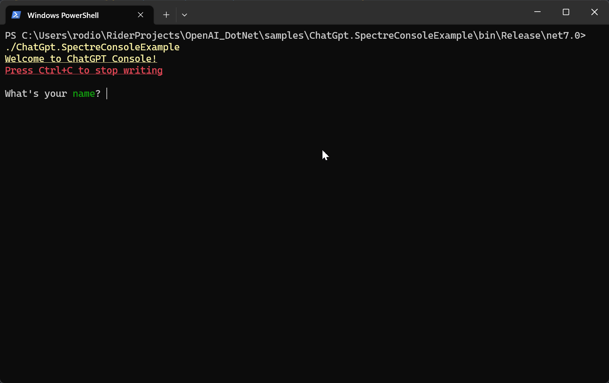

[](samples/ChatGpt.SpectreConsoleExample/Program.cs)
# ChatGPT integration for .NET (+DI)
[](https://www.nuget.org/packages/OpenAI.ChatGPT.EntityFrameworkCore/)[](https://github.com/rodion-m/ChatGPT_API_dotnet/actions/workflows/dotnet.yml) \
OpenAI Chat Completions API (ChatGPT) integration with DI and EF Core supporting. It allows you to use the API in your .NET applications. Also, the client supports streaming responses (like ChatGPT) via async streams.

## 2023.11 UPD: GPT4Turbo and JSON mode support
`StructuredResponse` module allows you to get structured responses from the API as C# object. See: [StructuredResponse](#structuredresponse) section.

## Content
<!-- TOC -->
* [ChatGPT integration for .NET](#chatgpt-integration-for-net)
  * [Preparation](#preparation)
  * [Installation](#installation)
  * [Usage](#usage)
  * [Exceptions](#exceptions)
  * [Thread safety and async](#thread-safety-and-async)
  * [Retries, timeouts and other policies](#retries-timeouts-and-other-policies)
  * [Modules](#modules)
    * [StructuredResponse](#structuredresponse)
    * [Translator](#translator)
  * [Examples](#examples)
  * [API Parameters](#api-parameters)
    * [Model](#model)
    * [MaxTokens](#maxtokens)
    * [Temperature](#temperature)
* [Using raw client without DI](#using-raw-client-without-di)
  * [Simple usage of the Chat Completions API (raw client)](#simple-usage-of-the-chat-completions-api-raw-client)
  * [Streaming response with async streams (like ChatGPT)](#streaming-response-with-async-streams-like-chatgpt)
  * [Continue dialog with ChatGPT (message history)](#continue-dialog-with-chatgpt-message-history)
<!-- TOC -->

## Preparation
First, you need to create an OpenAI account and get an API key. You can do this at https://platform.openai.com/account/api-keys.

## Installation
The easiest way to use ChatGPT service in your .NET project with DI and persistence (EF Core) supporting is to install the NuGet package [OpenAI.ChatGPT.EntityFrameworkCore](https://www.nuget.org/packages/OpenAI.ChatGPT.EntityFrameworkCore/):
```
Install-Package OpenAI.ChatGPT.EntityFrameworkCore
```
If you don't want to use EF Core, you can install the package [OpenAI.ChatGPT.AspNetCore](https://www.nuget.org/packages/OpenAI.ChatGPT.AspNetCore/) and implement your own storage for chat history, using `IChatHistoryStorage` interface.

## Usage
1. Set the OpenAI API key or even host (optional) in your project user secrets, or the `appsettings.json` file (not safe):
```json
{
  "OpenAICredentials": {
    "ApiKey": "your-api-key-from-openai",
    "ApiHost": "https://api.openai.com/v1/"
  }
}
```
Also, you can specify OpenAI API key as environment variable `ASPNETCORE_OpenAICredentials:ApiKey`.

2. Add ChatGPT integration with EF to your DI container:
```csharp
builder.Services.AddChatGptEntityFrameworkIntegration(
    options => options.UseSqlite("Data Source=chats.db"));
```
Instead of `options.UseSqlite("Data Source=chats.db")` use your own db and connection string.

3. Inject `ChatGPTFactory` to your service and use it to create `ChatGPT` instance:
```csharp
public class YourService
{
    private readonly ChatGPTFactory _chatGptFactory;

    public YourService(ChatGPTFactory chatGptFactory)
    {
        _chatGptFactory = chatGptFactory;
    }

    public async Task<string> GetAnswer(string text)
    {
        ChatGPT chatGpt = await _chatGptFactory.Create(userId);
        var chatService = await chatGpt.ContinueOrStartNewTopic();
        response = await _chatService.GetNextMessageResponse(_prompt);
        return response;
    }
}
```
See [Blazor Example](samples/ChatGpt.BlazorExample/Pages/Index.razor).

If you want to configure request parameters, you can do it in `appsettings.json` configuration or in `ChatGPTFactory.Create` or in `ChatGPT.CreateChat` methods.
```json
{
  "ChatGPTConfig": {
      "InitialSystemMessage": null,
      "InitialUserMessage": null,
      "MaxTokens": null,
      "Model": null,
      "Temperature": null,
      "PassUserIdToOpenAiRequests": true
  }
}
```
See parameters description inside [ChatGPTConfig](OpenAI.ChatGpt/Models/ChatGPTConfig.cs).

## Exceptions
If the server response is not a success status code, the client will throw a [NotExpectedResponseException](OpenAI.ChatGpt/Exceptions/NotExpectedResponseException.cs). The exception will contain the error message from the OpenAI API. \
By default, requesting cancellation or `ChatService.Stop()` method calling will throw `OperationCanceledException`. If you don't want to throw it (relevant for streaming responses), you can set `throwOnCancellation` parameter to `false`:
```csharp
await foreach (string chunk in chatService.StreamNextMessageResponse(text, throwOnCancellation: false))
{
    //...
}
```

## Thread safety and async
`ChatGPTFactory`, `ChatGPT` classes thread-safety is depend on the `IChatHistoryStorage` implementation. If you use `ChatGPTFactory` with entity framework, it's NOT thread-safe. `ChatService` class is not thread-safe. \
Anyways, these services are designed to be used safely with DI, so you don't need to worry about it. \
All the methods from all the packages are designed to be used in async context and use `ConfigureAwait(false)` (thanks for the `ConfigureAwait.Fody` package).

## Retries, timeouts and other policies
Since `ChatGPTFactory` depends on `IHttpClientFactory`, you can easily use any of the available policies for it, like `Polly`.

## Modules
### StructuredResponse
This module allows you to get structured responses from the API as C# object. It's useful if you want to use the API for something more than just chat.

```csharp
record City(string Name, int YearOfFoundation, string Country);

var message = Dialog
    .StartAsSystem("Return requested data.")
    .ThenUser("I need info about Almaty city");
City almaty = await _client.GetStructuredResponse<City>(message, model: ChatCompletionModels.Gpt4Turbo);
Console.WriteLine(almaty); // Name: "Almaty", Country: "Kazakhstan", YearOfFoundation: 1854
```
Under the hood, it uses the new [json mode](https://platform.openai.com/docs/guides/text-generation/json-mode) of the API for GPT4Turbo and for the `gpt-3.5-turbo-1106`. Regular GPT4 and GPT3.5Turbo models are also supported, but GPT3.5 responses may be unstable (for GPT3.5 it's strictly recommended to provide `examples` parameter).

More complex examples with arrays, nested objects and enums are available in tests: https://github.com/rodion-m/ChatGPT_API_dotnet/blob/f50d386f0b65a4ba8c1041a28bab2a1a475c2296/tests/OpenAI.ChatGpt.IntegrationTests/OpenAiClientTests/OpenAiClient_GetStructuredResponse.cs#L1

NuGet: https://www.nuget.org/packages/OpenAI.ChatGPT.Modules.StructuredResponse

### Translator
This module allows you to translate messages from one language to another.
```csharp
string textToTranslate = "Hello, world!";
string translatedText = await _client.TranslateText(textToTranslate, "English", "Russian");
Console.WriteLine(translatedText); // "Привет, мир!"
```
Also, it's possible to translate entire object in pair with `StructuredResponse` module:
```csharp
var objectToTranslate = new Order(
    new List<Order.Item> 
    {
        new(1,"Book", 5),
        new(2,"Pen", 10),
        new(3,"Notebook", 3)
    }
);
Order translatedObject = await _client.TranslateObject(objectToTranslate, "English", "Russian");
```

See full example in tests: https://github.com/rodion-m/ChatGPT_API_dotnet/blob/11658b76b497b9cc4ac74621c91c5e22cd724f2e/tests/OpenAI.ChatGpt.IntegrationTests/ChatGptTranslatorServiceTests.cs#L36

NuGet: https://www.nuget.org/packages/OpenAI.ChatGPT.Modules.Translator

## Examples
* [Blazor Example](samples/ChatGpt.BlazorExample)
* [Console Example](samples/ChatGpt.ConsoleExample/Program.cs) (simple)
* [Spectre Console Example](samples/ChatGpt.SpectreConsoleExample/Program.cs) (advanced)

## API Parameters
Here is a list of the main parameters that can be used in the ChatCompletions (ChatGPT) API request (OpenAI.ChatGpt/Models/ChatCompletion/ChatCompletionRequest.cs).
Some of them are taken from this article: https://towardsdatascience.com/gpt-3-parameters-and-prompt-design-1a595dc5b405 \
Below listed parameters for ChatCompletions API.

### Model
The prediction-generating AI model is specified by the engine parameter. The available models are described below: https://platform.openai.com/docs/models

| C# Model                                   | API Model              |
|--------------------------------------------|------------------------|
| ChatCompletionModels.Gpt4Turbo             | gpt-4-1106-preview     |
| ChatCompletionModels.Gpt4                  | gpt-4                  |
| ChatCompletionModels.Gpt4_0613             | gpt-4-0613             |
| ChatCompletionModels.Gpt4_32k              | gpt-4-32k              |
| ChatCompletionModels.Gpt4_32k_0613         | gpt-4-32k-0613         |
| ChatCompletionModels.Gpt3_5_Turbo          | gpt-3.5-turbo          |
| ChatCompletionModels.Gpt3_5_Turbo_1106     | gpt-3.5-turbo-1106     |
| ChatCompletionModels.Gpt3_5_Turbo_16k      | gpt-3.5-turbo-16k      |
| ChatCompletionModels.Gpt3_5_Turbo_0613     | gpt-3.5-turbo-0613     |
| ChatCompletionModels.Gpt3_5_Turbo_16k_0613 | gpt-3.5-turbo-16k-0613 |
| ChatCompletionModels.Gpt4_0314             | gpt-4-0314             |
| ChatCompletionModels.Gpt4_32k_0314         | gpt-4-32k-0314         |
| ChatCompletionModels.Gpt3_5_Turbo_0301     | gpt-3.5-turbo-0301     |

### MaxTokens
The maximum number of tokens allowed for the generated answer. Defaults to `ChatCompletionRequest.MaxTokensDefault` (64).
* This value is validated and limited with `ChatCompletionModels.GetMaxTokensLimitForModel` method.
* It's possible to calculate approximately tokens count using `ChatCompletionMessage.CalculateApproxTotalTokenCount` method
* The number of tokens can be retrieved from the API response: `ChatCompletionResponse.Usage.TotalTokens`.
  As a rule of thumb for English, 1 token is around 4 characters (so 100 tokens ≈ 75 words). See tokenizer from OpenAI: https://platform.openai.com/tokenizer
* Encoding algorithm can be found here: https://github.com/latitudegames/GPT-3-Encoder

### Temperature
What sampling temperature to use, between 0 and 2.
* Higher values like 0.8 will make the output more random, while lower values like 0.2 will make it more focused and deterministic.
* Predefined values are available in `ChatCompletionTemperatures`.
* Default value is: `ChatCompletionTemperatures.Balanced` (0.5).

Description:
Before being mapped into probabilities, the model outputs unnormalized values (logits). The logits are typically used with a function such as softmax to convert them into probabilities.

But, before applying the softmax function, we can use a trick inspired by thermodynamics and scale the logits with the temperature parameter, i.e. softmax(logits/temperature).

A temperature parameter close to 1 would mean that the logits are passed through the softmax function without modification. If the temperature is close to zero, the highest probable tokens will become very likely compared to the other tokens, i.e. the model becomes more deterministic and will always output the same set of tokens after a given sequence of words.

More parameters description can be found here: Some of them are taken from this article: https://towardsdatascience.com/gpt-3-parameters-and-prompt-design-1a595dc5b405

# Using raw client without DI
If you don't need DI and chat history, you can use only the NuGet package [OpenAI.ChatGPT](https://www.nuget.org/packages/OpenAI.ChatGPT):
```
Install-Package OpenAI.ChatGPT
```
Then create an instance of `OpenAIClient`:
```csharp
_client = new OpenAiClient("{YOUR_OPENAI_API_KEY}");
```

## Simple usage of the Chat Completions API (raw client)
```csharp
string text = "Who are you?";
string response = await _client.GetChatCompletions(new UserMessage(text), maxTokens: 80);
Console.WriteLine(response);
```

## Streaming response with async streams (like ChatGPT)
```csharp
var text = "Write the world top 3 songs of Soul genre";
await foreach (string chunk in _client.StreamChatCompletions(new UserMessage(text), maxTokens: 80))
{
    Console.Write(chunk);
}
```

## Continue dialog with ChatGPT (message history)
Use `ThenAssistant` and `ThenUser` methods to create a dialog:
```csharp
var dialog = Dialog.StartAsUser("How many meters are in a kilometer? Write just the number.") //the message from user
          .ThenAssistant("1000") // response from the assistant
          .ThenUser("Convert it to hex. Write just the number."); // the next message from user

await foreach (var chunk in _client.StreamChatCompletions(dialog, maxTokens: 80))
{
    Console.Write(chunk);
}
```
Or just send message history as a collection.
